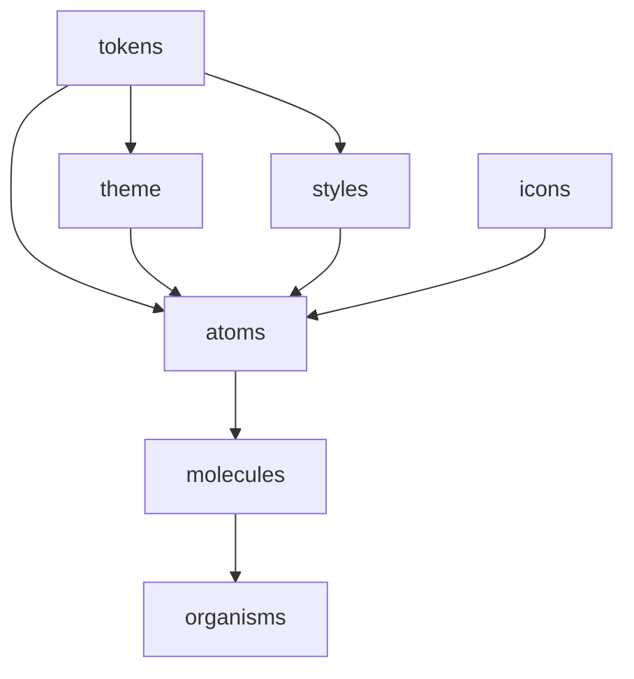

# Now Design System - Engineering Wiki

> **Technical documentation for developers working with the Now Design System**

---

## 📋 Table of Contents

1. [System Overview](#system-overview)
2. [Architecture](#architecture)
3. [Package Structure](#package-structure)
4. [Development Setup](#development-setup)
5. [Build System](#build-system)
6. [Component Development](#component-development)
7. [Token System](#token-system)
8. [Theming System](#theming-system)
9. [Testing Strategy](#testing-strategy)
10. [Deployment & Publishing](#deployment--publishing)
11. [Performance Optimization](#performance-optimization)
12. [Troubleshooting](#troubleshooting)
13. [Contributing Guidelines](#contributing-guidelines)

---

## 🎯 System Overview

### **What is Now Design System?**

The Now Design System is a comprehensive, enterprise-grade design system built as a monorepo using npm workspaces. It provides a complete ecosystem of design tokens, React components, icons, theming, and styling utilities for Now Purchase and Metal Cloud applications.

### **Core Principles**

- **⚛️ Atomic Design**: Strict adherence to Brad Frost's methodology
- **🎨 Design Consistency**: Unified design language across applications
- **🔄 Scalability**: Modular architecture for independent development
- **⚡ Performance**: Optimized for production use
- **🛠️ Developer Experience**: Intuitive APIs and comprehensive documentation

### **Tech Stack**

- **Monorepo**: npm workspaces
- **Tokens**: Style Dictionary
- **Components**: React 16.8+
- **Documentation**: Storybook 6.5
- **Styling**: CSS Variables + SCSS
- **Build**: Babel + custom scripts
- **Testing**: Jest + Testing Library

---

## 🏗️ Architecture

### **Monorepo Structure**

```
now-design/
├── packages/
│   ├── tokens/           # Design tokens (CSS/SCSS/JS)
│   ├── theme/            # React theming provider
│   ├── styles/           # CSS utility classes
│   ├── icons/            # React icon components
│   ├── atoms/            # Atomic React components
│   ├── molecules/        # Molecular components (future)
│   └── organisms/        # Organism components (future)
├── .storybook/           # Storybook configuration
├── build/                # Build artifacts
└── docs/                 # Documentation
```

### **Package Dependencies**



### **Data Flow**

1. **Design Tokens** → Style Dictionary → CSS/SCSS/JS outputs
2. **Tokens** → Theme Provider → CSS Variables
3. **Components** → Storybook → Documentation
4. **Icons** → SVGR → React Components

---

## 📦 Package Structure

### **1. now-design-tokens**

**Purpose**: Centralized design values and token management

**Key Files**:
- `build-tokens.js` - Custom build script
- `color/` - Color token definitions
- `scale/` - Spacing and sizing tokens
- `typography/` - Typography tokens
- `dist/` - Generated outputs (CSS/SCSS/JS)

**Build Command**:
```bash
cd packages/tokens
node build-tokens.js
```

### **2. now-design-theme**

**Purpose**: React theming provider and hooks

**Key Files**:
- `src/ThemeContext.jsx` - Theme provider implementation
- `src/index.js` - Package exports

**Features**:
- Light/dark theme switching
- System theme detection
- Theme persistence
- CSS variable injection

### **3. now-design-styles**

**Purpose**: CSS utility classes and typography

**Key Files**:
- `text/` - Typography utilities
- `color/` - Color utilities
- `effect/` - Effect utilities
- `fonts/` - Font definitions

**Build Command**:
```bash
cd packages/styles
npm run build
```

### **4. now-design-icons**

**Purpose**: React icon component library

**Key Files**:
- `raw/` - Source SVG files
- `src/react/` - React components
- `scripts/` - Build and generation scripts

**Build Command**:
```bash
cd packages/icons
npm run build
```

### **5. now-design-atoms**

**Purpose**: Atomic React components

**Key Files**:
- `src/` - Component source code
- `dist/` - Built components
- `stories/` - Storybook stories

**Build Command**:
```bash
cd packages/atoms
npm run build
```

---

## 🚀 Development Setup

### **Prerequisites**

- Node.js 16+
- npm 8+
- Git

### **Installation**

```bash
# Clone repository
git clone <repository-url>
cd now-design

# Install dependencies
npm install

# Build all packages
npm run build-tokens
```

### **Development Commands**

```bash
# Start Storybook
npm run storybook

# Build tokens
npm run build-tokens

# Build specific package
npm run --workspace=now-design-atoms build

# Test packages
npm run --workspace=now-design-atoms test
```

### **Workspace Management**

```bash
# Install dependency in specific package
npm install lodash --workspace=now-design-atoms

# Run script in all packages
npm run build --workspaces

# List all workspaces
npm run --workspaces info
```

---

## 🔧 Build System

### **Token Generation**

The token system uses Style Dictionary with custom formatters:

```javascript
// packages/tokens/build-tokens.js
const StyleDictionary = require('style-dictionary');
const responsiveFormat = require('./formats/responsive-css.js');

// Register custom formatter
StyleDictionary.registerFormat(responsiveFormat);

// Build all platforms
StyleDictionary.extend(config).buildAllPlatforms();
```

### **Component Building**

Components are built using Babel:

```javascript
// packages/atoms/package.json
{
  "scripts": {
    "build": "babel src --out-dir dist --presets=@babel/preset-react,@babel/preset-env"
  }
}
```

### **Icon Generation**

Icons are processed using SVGR:

```javascript
// packages/icons/scripts/fetch-figma-icons.js
// Automated Figma icon fetching and SVGR conversion
```

### **Build Pipeline**

1. **Token Processing**: JSON → Style Dictionary → CSS/SCSS/JS
2. **Component Building**: JSX → Babel → ES5/ES6
3. **Icon Generation**: SVG → SVGR → React Components
4. **Documentation**: Stories → Storybook → Documentation

---

## 🧩 Component Development

### **Component Structure**

```
ComponentName/
├── ComponentName.jsx      # Component implementation
├── ComponentName.css      # Component styles
├── ComponentName.stories.jsx  # Storybook stories
├── index.js              # Component export
└── README.md             # Component documentation
```

### **Component Template**

```jsx
import React from 'react';
import PropTypes from 'prop-types';
import './ComponentName.css';

export const ComponentName = ({
  // Props with defaults
  variant = 'primary',
  size = 'medium',
  children,
  ...props
}) => {
  return (
    <div 
      className={`component-name component-name--${variant} component-name--${size}`}
      {...props}
    >
      {children}
    </div>
  );
};

ComponentName.propTypes = {
  variant: PropTypes.oneOf(['primary', 'secondary']),
  size: PropTypes.oneOf(['small', 'medium', 'large']),
  children: PropTypes.node,
};

ComponentName.defaultProps = {
  variant: 'primary',
  size: 'medium',
};

export default ComponentName;
```

### **Styling Guidelines**

- Use CSS variables for all design values
- Follow BEM methodology for class naming
- Implement responsive design with CSS media queries
- Support theme switching via CSS variables

### **Storybook Integration**

```jsx
// ComponentName.stories.jsx
import ComponentName from './ComponentName';

export default {
  title: 'Atoms/ComponentName',
  component: ComponentName,
  parameters: {
    docs: {
      description: {
        component: 'Component description'
      }
    }
  }
};

export const Primary = {
  args: {
    variant: 'primary',
    children: 'Primary Button'
  }
};
```

---

## 🎨 Token System

### **Token Structure**

```json
{
  "color": {
    "brand": {
      "primary": {
        "value": "#1579BE",
        "type": "color"
      }
    }
  },
  "scale": {
    "spacing": {
      "md": {
        "value": "16px",
        "type": "dimension"
      }
    }
  }
}
```

### **Token Categories**

- **Colors**: Brand, semantic, and functional colors
- **Scale**: Spacing, sizing, and responsive values
- **Typography**: Font families, sizes, weights, line heights
- **Effects**: Shadows, blurs, and visual effects

### **Responsive Tokens**

```json
{
  "gapSpacing": {
    "300": {
      "desktop": { "value": "12px" },
      "tablet": { "value": "6px" },
      "mobile": { "value": "4px" }
    }
  }
}
```

### **Token Usage**

```css
/* CSS Variables */
.my-component {
  background: var(--color-brand-primary);
  padding: var(--scale-spacing-md);
}

/* SCSS Variables */
.my-component {
  background: $color-brand-primary;
  padding: $scale-spacing-md;
}

/* JavaScript */
import tokens from 'now-design-tokens';
const primaryColor = tokens.color.brand.primary.value;
```

---

## 🌓 Theming System

### **Theme Provider**

```jsx
import { ThemeProvider, useTheme } from 'now-design-theme';

function App() {
  return (
    <ThemeProvider defaultTheme="light">
      <MyApp />
    </ThemeProvider>
  );
}
```

### **Theme Hook**

```jsx
function ThemeToggle() {
  const { theme, toggleTheme, setTheme } = useTheme();
  
  return (
    <button onClick={toggleTheme}>
      Current theme: {theme}
    </button>
  );
}
```

### **CSS Variable Injection**

The theme provider injects CSS variables:

```css
:root {
  --color-background: #ffffff;
  --color-text: #000000;
}

[data-theme="dark"] {
  --color-background: #000000;
  --color-text: #ffffff;
}
```

### **Custom Themes**

```jsx
const customTheme = {
  primary: '#123456',
  background: '#f0f0f0',
  text: '#222'
};

<ThemeProvider theme={customTheme}>
  <App />
</ThemeProvider>
```

---

## 🧪 Testing Strategy

### **Testing Stack**

- **Jest**: Test runner
- **Testing Library**: Component testing
- **Storybook**: Visual testing
- **Chromatic**: Visual regression testing

### **Component Testing**

```jsx
import { render, screen } from '@testing-library/react';
import { ThemeProvider } from 'now-design-theme';
import Button from './Button';

test('renders button with correct text', () => {
  render(
    <ThemeProvider>
      <Button>Click me</Button>
    </ThemeProvider>
  );
  
  expect(screen.getByText('Click me')).toBeInTheDocument();
});
```

### **Token Testing**

```jsx
import tokens from 'now-design-tokens';

test('tokens have required structure', () => {
  expect(tokens.color.brand.primary).toBeDefined();
  expect(tokens.scale.spacing.md).toBeDefined();
});
```

### **Visual Testing**

```bash
# Run Storybook
npm run storybook

# Run Chromatic
npx chromatic --project-token=<token>
```

---

## 🚀 Deployment & Publishing

### **Package Publishing**

```bash
# Build all packages
npm run build-tokens
npm run --workspaces build

# Publish specific package
cd packages/atoms
npm publish

# Publish all packages
npm run --workspaces publish
```

### **Version Management**

```bash
# Bump version
npm version patch --workspace=now-design-atoms

# Update all packages
npm run --workspaces version patch
```

### **CI/CD Pipeline**

```yaml
# .github/workflows/publish.yml
name: Publish Packages
on:
  push:
    tags:
      - 'v*'

jobs:
  publish:
    runs-on: ubuntu-latest
    steps:
      - uses: actions/checkout@v2
      - uses: actions/setup-node@v2
      - run: npm ci
      - run: npm run build-tokens
      - run: npm run --workspaces build
      - run: npm run --workspaces publish
```

---

## ⚡ Performance Optimization

### **Bundle Size Optimization**

- **Tree Shaking**: Enable unused code removal
- **Code Splitting**: Split large components
- **Asset Optimization**: Optimize SVGs and images
- **CSS Purge**: Remove unused CSS

### **Loading Performance**

- **Font Loading**: Use `font-display: swap`
- **Icon Loading**: Lazy load non-critical icons
- **CSS Loading**: Critical CSS inlining
- **Component Loading**: Dynamic imports for large components

### **Runtime Performance**

- **Memoization**: Use React.memo for expensive components
- **Event Optimization**: Debounce and throttle event handlers
- **State Management**: Optimize re-renders
- **CSS Variables**: Use CSS variables for dynamic values

### **Monitoring**

```javascript
// Bundle analysis
npm run analyze

// Performance monitoring
import { performance } from 'perf_hooks';
const start = performance.now();
// ... component render
const end = performance.now();
console.log(`Render time: ${end - start}ms`);
```

---

## 🔧 Troubleshooting

### **Common Issues**

#### **Token Build Failures**

```bash
# Clear build cache
rm -rf packages/tokens/dist
rm -rf packages/tokens/build

# Rebuild tokens
cd packages/tokens
node build-tokens.js
```

#### **Component Import Errors**

```bash
# Clear node_modules
rm -rf node_modules package-lock.json
npm install

# Rebuild packages
npm run --workspaces build
```

#### **Storybook Issues**

```bash
# Clear Storybook cache
rm -rf node_modules/.cache/storybook
npm run storybook
```

#### **Theme Issues**

```jsx
// Ensure ThemeProvider wraps components
import { ThemeProvider } from 'now-design-theme';

function App() {
  return (
    <ThemeProvider>
      <YourComponents />
    </ThemeProvider>
  );
}
```

### **Debug Tools**

```bash
# Debug token generation
DEBUG=style-dictionary npm run build-tokens

# Debug component builds
DEBUG=babel npm run build

# Debug Storybook
DEBUG=storybook npm run storybook
```

### **Performance Issues**

```bash
# Bundle analysis
npm run analyze

# Performance profiling
npm run profile

# Memory leak detection
npm run debug
```

---

## 🤝 Contributing Guidelines

### **Development Workflow**

1. **Fork** the repository
2. **Create** a feature branch
3. **Develop** your changes
4. **Test** thoroughly
5. **Document** your changes
6. **Submit** a pull request

### **Code Standards**

- **ESLint**: Follow ESLint configuration
- **Prettier**: Use Prettier for code formatting
- **TypeScript**: Use TypeScript for new components
- **Testing**: Write tests for all new features

### **Commit Guidelines**

```
type(scope): description

feat(atoms): add new Button component
fix(tokens): resolve color token issue
docs(readme): update installation guide
```

### **Pull Request Process**

1. **Description**: Clear description of changes
2. **Testing**: Include test coverage
3. **Documentation**: Update relevant docs
4. **Review**: Request code review
5. **CI/CD**: Ensure all checks pass

### **Release Process**

1. **Version Bump**: Update package versions
2. **Changelog**: Update CHANGELOG.md
3. **Build**: Build all packages
4. **Test**: Run full test suite
5. **Publish**: Publish to npm
6. **Tag**: Create git tag

---

## 📚 Additional Resources

### **Documentation**

- [Design System Documentation](./DESIGN_SYSTEM_DOCUMENTATION.md)
- [Package READMEs](./packages/*/README.md)
- [Storybook Documentation](http://localhost:6006)

### **External Resources**

- [Atomic Design Methodology](https://bradfrost.com/blog/post/atomic-web-design/)
- [Style Dictionary Documentation](https://amzn.github.io/style-dictionary/)
- [Storybook Documentation](https://storybook.js.org/)
- [React Documentation](https://reactjs.org/)

### **Support**

- **Issues**: [GitHub Issues](https://github.com/your-org/now-design/issues)
- **Discussions**: [GitHub Discussions](https://github.com/your-org/now-design/discussions)
- **Documentation**: [GitHub Wiki](https://github.com/your-org/now-design/wiki)

---

**Last Updated**: July 14, 2025  
**Version**: 1.0.0  
**Maintainers**: Now Design System Team 