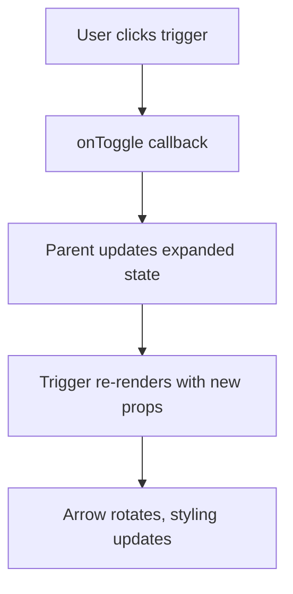

# AccordionTrigger Component

A clickable header component that serves as the expandable/collapsible trigger for accordion interfaces. Features responsive design, theme support, and smooth hover interactions.

## 🎯 Overview

The `AccordionTrigger` component provides:
- **Clickable header** for accordion expansion/collapse
- **Icon support** with optional left-aligned icon
- **Responsive typography** that adapts to screen sizes
- **Theme integration** with smooth background transitions
- **Accessibility features** including keyboard navigation
- **Visual feedback** with hover and active states

## 📦 Installation

```bash
npm install now-design-atoms
```

## 🚀 Basic Usage

### Simple Implementation

```jsx
import { AccordionTrigger } from 'now-design-atoms';
import { SystemAddFill } from 'now-design-icons';

function MyComponent() {
  const [isExpanded, setIsExpanded] = useState(false);

  return (
    <AccordionTrigger
      label="Account Settings"
      expanded={isExpanded}
      onToggle={() => setIsExpanded(!isExpanded)}
      icon={SystemAddFill}
    />
  );
}
```

### With Custom Styling

```jsx
function MyComponent() {
  const [isExpanded, setIsExpanded] = useState(false);

  return (
    <AccordionTrigger
      label="Advanced Configuration"
      expanded={isExpanded}
      onToggle={() => setIsExpanded(!isExpanded)}
      icon={SystemAddFill}
      className="custom-trigger"
      style={{
        backgroundColor: 'var(--custom-bg)',
        border: '2px solid var(--custom-border)'
      }}
    />
  );
}
```

### Without Icon

```jsx
function MyComponent() {
  const [isExpanded, setIsExpanded] = useState(false);

  return (
    <AccordionTrigger
      label="Simple Accordion"
      expanded={isExpanded}
      onToggle={() => setIsExpanded(!isExpanded)}
    />
  );
}
```

## 📋 Props API

### Required Props

| Prop | Type | Description |
|------|------|-------------|
| `label` | `string` | Text label for the trigger |
| `expanded` | `boolean` | Whether the accordion is expanded |
| `onToggle` | `function` | Callback when trigger is clicked |

### Optional Props

| Prop | Type | Default | Description |
|------|------|---------|-------------|
| `icon` | `ReactNode` | - | Icon component to display on the left |
| `className` | `string` | `''` | Additional CSS classes |
| `style` | `object` | `{}` | Additional inline styles |

## 🎨 Visual Design

### Component Structure

```
┌─────────────────────────────────────────┐
│ [Icon] Label Text              [Arrow ▼] │
└─────────────────────────────────────────┘
```

### Visual States

1. **Default State**
   - Background: Transparent
   - Text: Primary typography color
   - Icon: Primary icon color
   - Arrow: Points down (▼)

2. **Hover State**
   - Background: Hover surface color
   - Text: Hover typography color
   - Icon: Hover icon color
   - Smooth transition

3. **Active State**
   - Background: Active surface color
   - Text: Action typography color
   - Icon: Action icon color
   - Arrow: Points up (▲) when expanded

4. **Expanded State**
   - Arrow rotates 180° to point up
   - Maintains active styling
   - Smooth rotation animation

## 🎨 Styling

### CSS Classes

```css
.accordion-trigger                    /* Main container */
.accordion-trigger-icon              /* Icon wrapper */
.accordion-trigger-label             /* Label text */
.accordion-trigger-arrow             /* Expand/collapse arrow */
```

### Design Tokens Used

```css
/* Spacing */
--gap-spacing-400: 16px  /* Horizontal padding */
--gap-spacing-600: 24px  /* Horizontal padding */

/* Colors */
--normal-surface-page: #FFF
--normal-typography-bodyPrimary: #222
--normal-typography-hover: #0052cc
--normal-typography-action: #0052cc
--normal-icon-iconPrimary: #666
--normal-icon-hover: #0052cc
--normal-icon-action: #0052cc

/* Typography */
--fontSize-heading-h4: 12px
--lineHeight-heading-h4: 16px
--fontWeight-regular: 400
--fontWeight-bold: 600

/* Border Radius */
--border-radius-m: 8px

/* Transitions */
--transition-duration: 0.3s
```

### Responsive Behavior

```css
/* Mobile (max-width: 480px) */
@media (max-width: 480px) {
  .accordion-trigger {
    padding: 12px 16px;
  }
}

/* Tablet (max-width: 768px) */
@media (max-width: 768px) {
  .accordion-trigger {
    padding: 14px 20px;
  }
}

/* Desktop (max-width: 900px) */
@media (max-width: 900px) {
  .accordion-trigger .regular-h4,
  .accordion-trigger .bold-h4 {
    font-size: 12px !important;
    line-height: 1 !important;
    letter-spacing: 0px !important;
  }
}
```

## 🔧 State Management

### Internal State

The component is purely presentational and doesn't manage its own state. All state is controlled by the parent component:

```javascript
// Parent component manages state
const [isExpanded, setIsExpanded] = useState(false);

// Pass state and handlers to trigger
<AccordionTrigger
  expanded={isExpanded}
  onToggle={() => setIsExpanded(!isExpanded)}
  label="My Accordion"
/>
```

### State Flow



## 🎭 Event Handling

### Click Handler

```javascript
const handleClick = (event) => {
  event.preventDefault();
  onToggle();
};
```

### Keyboard Handler

```javascript
const handleKeyDown = (event) => {
  if (event.key === 'Enter' || event.key === ' ') {
    event.preventDefault();
    onToggle();
  }
};
```

### Focus Management

```javascript
// Component is focusable
<div
  role="button"
  tabIndex={0}
  onKeyDown={handleKeyDown}
  onClick={handleClick}
>
  {/* Content */}
</div>
```

## ♿ Accessibility

### ARIA Attributes

```jsx
<div
  role="button"
  aria-expanded={expanded}
  aria-label={`${label} accordion`}
  tabIndex={0}
  onKeyDown={handleKeyDown}
  onClick={handleClick}
>
  {/* Content */}
</div>
```

### Keyboard Navigation

- **Tab**: Focus the trigger
- **Enter/Space**: Toggle accordion
- **Arrow keys**: Navigate to next/previous focusable element

### Screen Reader Support

- **aria-expanded**: Indicates current state
- **aria-label**: Provides context
- **role="button"**: Identifies as interactive element

## 🔄 Animations

### Arrow Rotation

```css
.accordion-trigger-arrow {
  transition: transform 0.3s ease;
}

.accordion-trigger.expanded .accordion-trigger-arrow {
  transform: rotate(180deg);
}
```

### Background Transitions

```css
.accordion-trigger {
  transition: background 0.3s ease;
}

.accordion-trigger:hover {
  background: var(--normal-surface-hover);
}
```

### Color Transitions

```css
.accordion-trigger-label {
  transition: color 0.3s ease;
}

.accordion-trigger-icon {
  transition: color 0.3s ease;
}
```

## 🧪 Testing

### Component Testing

```javascript
import { render, screen, fireEvent } from '@testing-library/react';
import { AccordionTrigger } from 'now-design-atoms';

test('renders with label and icon', () => {
  const onToggle = jest.fn();
  
  render(
    <AccordionTrigger
      label="Test Accordion"
      expanded={false}
      onToggle={onToggle}
      icon={SystemAddFill}
    />
  );
  
  expect(screen.getByText('Test Accordion')).toBeInTheDocument();
  expect(screen.getByRole('button')).toBeInTheDocument();
});

test('calls onToggle when clicked', () => {
  const onToggle = jest.fn();
  
  render(
    <AccordionTrigger
      label="Test Accordion"
      expanded={false}
      onToggle={onToggle}
    />
  );
  
  fireEvent.click(screen.getByRole('button'));
  expect(onToggle).toHaveBeenCalledTimes(1);
});
```

### Accessibility Testing

```javascript
test('has correct ARIA attributes', () => {
  render(
    <AccordionTrigger
      label="Test Accordion"
      expanded={true}
      onToggle={jest.fn()}
    />
  );
  
  const button = screen.getByRole('button');
  expect(button).toHaveAttribute('aria-expanded', 'true');
  expect(button).toHaveAttribute('aria-label', 'Test Accordion accordion');
});

test('responds to keyboard events', () => {
  const onToggle = jest.fn();
  
  render(
    <AccordionTrigger
      label="Test Accordion"
      expanded={false}
      onToggle={onToggle}
    />
  );
  
  const button = screen.getByRole('button');
  fireEvent.keyDown(button, { key: 'Enter' });
  expect(onToggle).toHaveBeenCalledTimes(1);
  
  fireEvent.keyDown(button, { key: ' ' });
  expect(onToggle).toHaveBeenCalledTimes(2);
});
```

### Visual Testing

```javascript
test('shows correct arrow direction', () => {
  const { rerender } = render(
    <AccordionTrigger
      label="Test Accordion"
      expanded={false}
      onToggle={jest.fn()}
    />
  );
  
  // Arrow should point down when collapsed
  const arrow = document.querySelector('.accordion-trigger-arrow');
  expect(arrow).toHaveStyle({ transform: 'rotate(0deg)' });
  
  // Re-render with expanded state
  rerender(
    <AccordionTrigger
      label="Test Accordion"
      expanded={true}
      onToggle={jest.fn()}
    />
  );
  
  // Arrow should point up when expanded
  expect(arrow).toHaveStyle({ transform: 'rotate(180deg)' });
});
```

## 🐛 Troubleshooting

### Common Issues

1. **Text disappearing at small screen sizes**
   - **Cause**: Responsive typography setting font-size to 0
   - **Solution**: CSS overrides already implemented for max-width: 900px

2. **Background not changing on theme switch**
   - **Cause**: Hardcoded background color
   - **Solution**: Removed `background: var(--normal-surface-page)` to allow transparency

3. **Arrow not rotating**
   - **Cause**: CSS transitions not applied
   - **Solution**: Ensure CSS is properly imported

4. **Click not working**
   - **Cause**: Missing onToggle prop
   - **Solution**: Always provide onToggle callback

### Performance Tips

- **Memoization**: Consider wrapping in `React.memo` if parent re-renders frequently
- **Event delegation**: Click events are handled efficiently
- **CSS transitions**: Hardware-accelerated animations

## 📈 Performance Considerations

### Optimization Techniques

- **React.memo**: Prevents unnecessary re-renders
- **useCallback**: For event handlers in parent components
- **CSS transitions**: Hardware-accelerated animations
- **Minimal DOM**: Clean, semantic HTML structure

### Bundle Impact

- **Size**: ~5KB (minified + gzipped)
- **Dependencies**: React, now-design-tokens
- **Tree-shaking**: Fully supported

## 🔮 Future Enhancements

### Planned Features

- [ ] **Custom arrow icons**: Allow custom expand/collapse icons
- [ ] **Loading state**: Show loading indicator during async operations
- [ ] **Badge support**: Display notification badges
- [ ] **Custom animations**: Configurable animation durations
- [ ] **RTL support**: Right-to-left language support

### API Improvements

- [ ] **Render props**: Custom trigger content rendering
- [ ] **Size variants**: Small, medium, large trigger sizes
- [ ] **Color variants**: Primary, secondary, tertiary styles
- [ ] **Icon positioning**: Left, right, or no icon options

## 🎨 Customization Examples

### Custom Theme Integration

```jsx
// Custom themed trigger
<AccordionTrigger
  label="Custom Theme"
  expanded={isExpanded}
  onToggle={() => setIsExpanded(!isExpanded)}
  className="custom-theme-trigger"
/>

// Custom CSS
.custom-theme-trigger {
  background: linear-gradient(135deg, var(--custom-primary), var(--custom-secondary));
  color: white;
  border-radius: 12px;
  box-shadow: 0 4px 12px rgba(0,0,0,0.15);
}
```

### Animated Trigger

```jsx
// Trigger with custom animations
<AccordionTrigger
  label="Animated Trigger"
  expanded={isExpanded}
  onToggle={() => setIsExpanded(!isExpanded)}
  className="animated-trigger"
/>

// Custom animations
.animated-trigger {
  transition: all 0.4s cubic-bezier(0.4, 0, 0.2, 1);
}

.animated-trigger:hover {
  transform: translateY(-2px);
  box-shadow: 0 8px 24px rgba(0,0,0,0.12);
}
```

---

**Component Version**: 1.0.0  
**Last Updated**: 2024  
**Maintainer**: Design System Team 