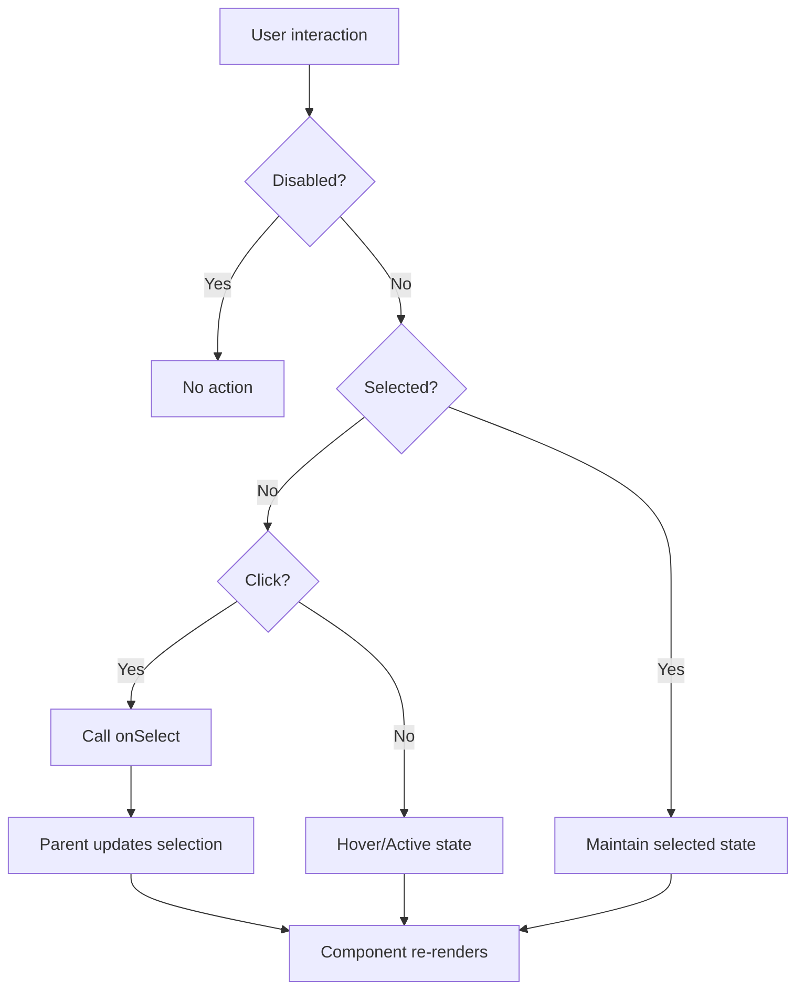

# SelectableListItem Component

A versatile, interactive list item component that provides selection functionality with visual feedback, hover states, and accessibility features. Designed for use within accordion lists and navigation menus.

## 🎯 Overview

The `SelectableListItem` component offers:
- **Selection state** with visual indicator
- **Hover and active states** with smooth transitions
- **Icon support** with dynamic color changes
- **Responsive typography** that adapts to screen sizes
- **Accessibility features** including keyboard navigation
- **Disabled state** for non-interactive items
- **Theme integration** with design token support

## 📦 Installation

```bash
npm install now-design-atoms
```

## 🚀 Basic Usage

### Simple Implementation

```jsx
import { SelectableListItem } from 'now-design-atoms';
import { SystemAddFill } from 'now-design-icons';

function MyComponent() {
  const [selectedItem, setSelectedItem] = useState('profile');

  return (
    <SelectableListItem
      icon={SystemAddFill}
      label="Profile"
      selected={selectedItem === 'profile'}
      onSelect={() => setSelectedItem('profile')}
    />
  );
}
```

### With Multiple Items

```jsx
function MyComponent() {
  const [selectedItem, setSelectedItem] = useState('profile');

  const items = [
    { id: 'profile', label: 'Profile', icon: SystemAddFill },
    { id: 'settings', label: 'Settings', icon: WeatherSunFill },
    { id: 'help', label: 'Help', icon: WeatherSunLine },
  ];

  return (
    <div>
      {items.map(item => (
        <SelectableListItem
          key={item.id}
          icon={item.icon}
          label={item.label}
          selected={selectedItem === item.id}
          onSelect={() => setSelectedItem(item.id)}
        />
      ))}
    </div>
  );
}
```

### With Disabled State

```jsx
function MyComponent() {
  return (
    <SelectableListItem
      icon={SystemAddFill}
      label="Disabled Item"
      selected={false}
      onSelect={() => {}}
      disabled={true}
    />
  );
}
```

## 📋 Props API

### Required Props

| Prop | Type | Description |
|------|------|-------------|
| `icon` | `ReactNode` | Icon component to display |
| `label` | `string` | Text label for the item |
| `selected` | `boolean` | Whether the item is selected |
| `onSelect` | `function` | Callback when item is clicked |

### Optional Props

| Prop | Type | Default | Description |
|------|------|---------|-------------|
| `disabled` | `boolean` | `false` | Whether the item is disabled |
| `className` | `string` | `''` | Additional CSS classes |
| `style` | `object` | `{}` | Additional inline styles |

## 🎨 Visual Design

### Component Structure

```
┌─────────────────────────────────────────┐
│ [Icon] Label Text                       │
└─────────────────────────────────────────┘
```

### Visual States

1. **Default State**
   - Background: Transparent
   - Text: Secondary typography color
   - Icon: Primary icon color
   - No visual selection indicator

2. **Hover State**
   - Background: Hover surface color
   - Text: Hover typography color
   - Icon: Hover icon color
   - Typography: Bold weight
   - Smooth transition

3. **Active State**
   - Background: Active surface color
   - Text: Action typography color
   - Icon: Action icon color
   - Typography: Bold weight

4. **Selected State**
   - Background: Transparent (selection handled by parent)
   - Text: Action typography color
   - Icon: Action icon color
   - Typography: Bold weight
   - Takes precedence over hover/active states

5. **Disabled State**
   - Background: Disabled surface color
   - Text: Disabled typography color
   - Icon: Disabled icon color
   - No hover effects
   - Not clickable

## 🎨 Styling

### CSS Classes

```css
.selectable-list-item                    /* Main container */
.selectable-list-item-icon              /* Icon wrapper */
.selectable-list-item-label             /* Label text */
.selectable-list-item.selected          /* Selected state */
.selectable-list-item.disabled          /* Disabled state */
```

### Design Tokens Used

```css
/* Spacing */
--gap-spacing-400: 16px  /* Horizontal padding */
--gap-spacing-300: 12px  /* Vertical padding */

/* Colors */
--normal-surface-page: #FFF
--normal-surface-hover: #f5f5f5
--normal-surface-active: #e8f4fd
--normal-surface-disabled: #f8f9fa

--normal-typography-bodySecondary: #666
--normal-typography-hover: #0052cc
--normal-typography-action: #0052cc
--normal-typography-disabled: #999

--normal-icon-iconPrimary: #666
--normal-icon-hover: #0052cc
--normal-icon-action: #0052cc
--normal-icon-disabled: #999

/* Typography */
--fontSize-body-bodyLarge: 12px
--lineHeight-body-bodyLarge: 16px
--fontWeight-regular: 400
--fontWeight-bold: 600

/* Border Radius */
--border-radius-m: 8px

/* Transitions */
--transition-duration: 0.3s
```

### Responsive Behavior

```css
/* Mobile (max-width: 480px) */
@media (max-width: 480px) {
  .selectable-list-item {
    padding: 10px 12px;
  }
}

/* Tablet (max-width: 768px) */
@media (max-width: 768px) {
  .selectable-list-item {
    padding: 12px 16px;
  }
}

/* Desktop (max-width: 900px) */
@media (max-width: 900px) {
  .selectable-list-item .regular-bodyLarge,
  .selectable-list-item .bold-bodyLarge {
    font-size: 12px !important;
    line-height: 1 !important;
    letter-spacing: 0px !important;
  }
}
```

## 🔧 State Management

### State Priority Logic

The component uses a priority-based system for determining colors:

```javascript
// Icon color priority
const getIconColor = () => {
  if (disabled) return 'var(--normal-icon-disabled)';
  if (selected) return 'var(--normal-icon-action)'; // Selected takes priority
  if (isActive) return 'var(--normal-icon-action)';
  if (isHovered) return 'var(--normal-icon-hover)';
  return 'var(--normal-icon-iconPrimary)';
};

// Text color priority
const getTextColor = () => {
  if (disabled) return 'var(--normal-typography-disabled)';
  if (selected) return 'var(--normal-typography-action)'; // Selected takes priority
  if (isActive) return 'var(--normal-typography-action)';
  if (isHovered) return 'var(--normal-typography-hover)';
  return 'var(--normal-typography-bodySecondary)';
};
```

### State Flow



## 🎭 Event Handling

### Click Handler

```javascript
const handleClick = (event) => {
  event.preventDefault();
  if (!disabled) {
    onSelect();
  }
};
```

### Mouse Event Handlers

```javascript
const handleMouseEnter = () => {
  if (!disabled) {
    setIsHovered(true);
  }
};

const handleMouseLeave = () => {
  setIsHovered(false);
  setIsActive(false);
};

const handleMouseDown = () => {
  if (!disabled) {
    setIsActive(true);
  }
};

const handleMouseUp = () => {
  setIsActive(false);
};
```

### Keyboard Handler

```javascript
const handleKeyDown = (event) => {
  if (event.key === 'Enter' || event.key === ' ') {
    event.preventDefault();
    if (!disabled) {
      onSelect();
    }
  }
};
```

## ♿ Accessibility

### ARIA Attributes

```jsx
<div
  role="option"
  aria-selected={selected}
  aria-disabled={disabled}
  tabIndex={disabled ? -1 : 0}
  onKeyDown={handleKeyDown}
  onClick={handleClick}
  onMouseEnter={handleMouseEnter}
  onMouseLeave={handleMouseLeave}
  onMouseDown={handleMouseDown}
  onMouseUp={handleMouseUp}
>
  {/* Content */}
</div>
```

### Keyboard Navigation

- **Tab**: Focus the item (if not disabled)
- **Enter/Space**: Select the item
- **Arrow keys**: Navigate between items (handled by parent)

### Screen Reader Support

- **aria-selected**: Indicates current selection state
- **aria-disabled**: Indicates if item is disabled
- **role="option"**: Identifies as selectable option

## 🔄 Animations

### Color Transitions

```css
.selectable-list-item {
  transition: background 0.3s ease, color 0.3s ease;
}

.selectable-list-item-icon {
  transition: color 0.3s ease;
}

.selectable-list-item-label {
  transition: color 0.3s ease;
}
```

### Typography Transitions

```css
.selectable-list-item .regular-bodyLarge,
.selectable-list-item .bold-bodyLarge {
  transition: font-weight 0.2s ease;
}
```

## 🧪 Testing

### Component Testing

```javascript
import { render, screen, fireEvent } from '@testing-library/react';
import { SelectableListItem } from 'now-design-atoms';

test('renders with icon and label', () => {
  const onSelect = jest.fn();
  
  render(
    <SelectableListItem
      icon={SystemAddFill}
      label="Test Item"
      selected={false}
      onSelect={onSelect}
    />
  );
  
  expect(screen.getByText('Test Item')).toBeInTheDocument();
  expect(screen.getByRole('option')).toBeInTheDocument();
});

test('calls onSelect when clicked', () => {
  const onSelect = jest.fn();
  
  render(
    <SelectableListItem
      icon={SystemAddFill}
      label="Test Item"
      selected={false}
      onSelect={onSelect}
    />
  );
  
  fireEvent.click(screen.getByRole('option'));
  expect(onSelect).toHaveBeenCalledTimes(1);
});
```

### State Testing

```javascript
test('shows selected state correctly', () => {
  render(
    <SelectableListItem
      icon={SystemAddFill}
      label="Test Item"
      selected={true}
      onSelect={jest.fn()}
    />
  );
  
  const option = screen.getByRole('option');
  expect(option).toHaveAttribute('aria-selected', 'true');
  expect(option).toHaveClass('selected');
});

test('handles disabled state', () => {
  const onSelect = jest.fn();
  
  render(
    <SelectableListItem
      icon={SystemAddFill}
      label="Test Item"
      selected={false}
      onSelect={onSelect}
      disabled={true}
    />
  );
  
  const option = screen.getByRole('option');
  expect(option).toHaveAttribute('aria-disabled', 'true');
  expect(option).toHaveClass('disabled');
  
  fireEvent.click(option);
  expect(onSelect).not.toHaveBeenCalled();
});
```

### Accessibility Testing

```javascript
test('has correct ARIA attributes', () => {
  render(
    <SelectableListItem
      icon={SystemAddFill}
      label="Test Item"
      selected={true}
      onSelect={jest.fn()}
    />
  );
  
  const option = screen.getByRole('option');
  expect(option).toHaveAttribute('aria-selected', 'true');
  expect(option).toHaveAttribute('aria-disabled', 'false');
});

test('responds to keyboard events', () => {
  const onSelect = jest.fn();
  
  render(
    <SelectableListItem
      icon={SystemAddFill}
      label="Test Item"
      selected={false}
      onSelect={onSelect}
    />
  );
  
  const option = screen.getByRole('option');
  fireEvent.keyDown(option, { key: 'Enter' });
  expect(onSelect).toHaveBeenCalledTimes(1);
  
  fireEvent.keyDown(option, { key: ' ' });
  expect(onSelect).toHaveBeenCalledTimes(2);
});
```

### Visual Testing

```javascript
test('applies correct colors based on state', () => {
  const { rerender } = render(
    <SelectableListItem
      icon={SystemAddFill}
      label="Test Item"
      selected={false}
      onSelect={jest.fn()}
    />
  );
  
  // Default state
  const label = screen.getByText('Test Item');
  expect(label).toHaveStyle({ color: 'var(--normal-typography-bodySecondary)' });
  
  // Selected state
  rerender(
    <SelectableListItem
      icon={SystemAddFill}
      label="Test Item"
      selected={true}
      onSelect={jest.fn()}
    />
  );
  
  expect(label).toHaveStyle({ color: 'var(--normal-typography-action)' });
});
```

## 🐛 Troubleshooting

### Common Issues

1. **Text disappearing at small screen sizes**
   - **Cause**: Responsive typography setting font-size to 0
   - **Solution**: CSS overrides already implemented for max-width: 900px

2. **Unnecessary spacing with typography classes**
   - **Cause**: Line-height mismatch between font-size and line-height
   - **Solution**: CSS overrides set `line-height: 1 !important`

3. **Colors not changing on state change**
   - **Cause**: CSS specificity issues or missing transitions
   - **Solution**: Ensure CSS is properly imported and transitions are applied

4. **Click not working**
   - **Cause**: Disabled state or missing onSelect prop
   - **Solution**: Check disabled prop and ensure onSelect is provided

### Performance Tips

- **Memoization**: Consider wrapping in `React.memo` if parent re-renders frequently
- **Event delegation**: Mouse events are handled efficiently
- **CSS transitions**: Hardware-accelerated animations

## 📈 Performance Considerations

### Optimization Techniques

- **React.memo**: Prevents unnecessary re-renders
- **useCallback**: For event handlers in parent components
- **CSS transitions**: Hardware-accelerated animations
- **Conditional rendering**: Only render when needed

### Bundle Impact

- **Size**: ~8KB (minified + gzipped)
- **Dependencies**: React, now-design-tokens, now-design-icons
- **Tree-shaking**: Fully supported

## 🔮 Future Enhancements

### Planned Features

- [ ] **Custom selection indicators**: Allow custom selection visuals
- [ ] **Loading state**: Show loading indicator during async operations
- [ ] **Badge support**: Display notification badges
- [ ] **Custom animations**: Configurable animation durations
- [ ] **RTL support**: Right-to-left language support

### API Improvements

- [ ] **Render props**: Custom item content rendering
- [ ] **Size variants**: Small, medium, large item sizes
- [ ] **Color variants**: Primary, secondary, tertiary styles
- [ ] **Icon positioning**: Left, right, or no icon options

## 🎨 Customization Examples

### Custom Themed Item

```jsx
// Custom themed item
<SelectableListItem
  icon={SystemAddFill}
  label="Custom Theme"
  selected={selected}
  onSelect={() => setSelected(!selected)}
  className="custom-theme-item"
/>

// Custom CSS
.custom-theme-item {
  background: linear-gradient(135deg, var(--custom-primary), var(--custom-secondary));
  color: white;
  border-radius: 12px;
  box-shadow: 0 2px 8px rgba(0,0,0,0.1);
}

.custom-theme-item:hover {
  transform: translateY(-1px);
  box-shadow: 0 4px 12px rgba(0,0,0,0.15);
}
```

### Animated Item

```jsx
// Item with custom animations
<SelectableListItem
  icon={SystemAddFill}
  label="Animated Item"
  selected={selected}
  onSelect={() => setSelected(!selected)}
  className="animated-item"
/>

// Custom animations
.animated-item {
  transition: all 0.3s cubic-bezier(0.4, 0, 0.2, 1);
  position: relative;
  overflow: hidden;
}

.animated-item::before {
  content: '';
  position: absolute;
  top: 0;
  left: -100%;
  width: 100%;
  height: 100%;
  background: linear-gradient(90deg, transparent, rgba(255,255,255,0.2), transparent);
  transition: left 0.5s ease;
}

.animated-item:hover::before {
  left: 100%;
}
```

### Custom Selection Indicator

```jsx
// Item with custom selection indicator
<SelectableListItem
  icon={SystemAddFill}
  label="Custom Selection"
  selected={selected}
  onSelect={() => setSelected(!selected)}
  className="custom-selection-item"
/>

// Custom selection styles
.custom-selection-item.selected {
  background: var(--custom-selection-bg);
  border-left: 4px solid var(--custom-selection-border);
  padding-left: 12px;
}

.custom-selection-item.selected::after {
  content: '✓';
  position: absolute;
  right: 16px;
  color: var(--custom-selection-check);
  font-weight: bold;
}
```

---

**Component Version**: 1.0.0  
**Last Updated**: 2024  
**Maintainer**: Design System Team 