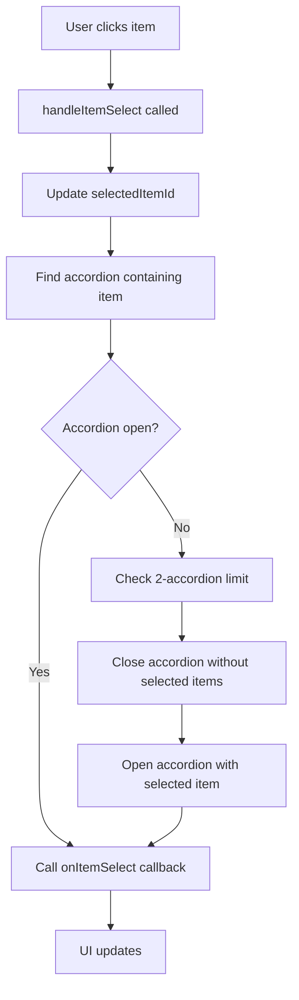
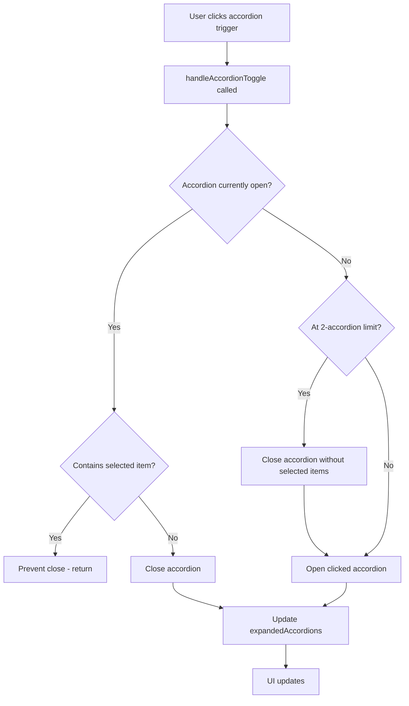

# AccordionSelectableListContainer Component

A container component that manages multiple `AccordionSelectableList` components with sophisticated business rules and state management. Enforces the "2-accordion limit" and "single global selection" rules.

## 🎯 Overview

The `AccordionSelectableListContainer` orchestrates multiple accordion components with:
- **2-Accordion Limit**: Only 2 accordions can be open simultaneously
- **Global Selection**: Only 1 item can be selected across all accordions
- **Auto-Open Logic**: Accordion containing selected item automatically opens
- **Prevent Close**: Cannot close accordion containing selected item
- **Smart State Management**: Handles complex state interactions

## 📦 Installation

```bash
npm install now-design-organisms
```

## 🚀 Basic Usage

### Simple Implementation

```jsx
import { AccordionSelectableListContainer } from 'now-design-organisms';
import { SystemAddFill, WeatherSunFill, MetalcloudMeltingFurnaceLine } from 'now-design-icons';

const accordionData = [
  {
    id: 'accordion-1',
    triggerLabel: 'ChargeMix',
    triggerIcon: MetalcloudMeltingFurnaceLine,
    items: [
      { id: 'profile', label: 'Profile', icon: SystemAddFill },
      { id: 'settings', label: 'Settings', icon: WeatherSunFill },
      { id: 'help', label: 'Help', icon: WeatherSunFill },
    ]
  },
  {
    id: 'accordion-2',
    triggerLabel: 'Account Settings',
    triggerIcon: SystemAddFill,
    items: [
      { id: 'preferences', label: 'Preferences', icon: WeatherSunFill },
      { id: 'security', label: 'Security', icon: SystemAddFill },
    ]
  }
];

function MyComponent() {
  const handleItemSelect = (itemId) => {
    console.log('Selected item:', itemId);
  };

  return (
    <AccordionSelectableListContainer
      accordionData={accordionData}
      onItemSelect={handleItemSelect}
    />
  );
}
```

### With Global State Management

```jsx
function MyComponent() {
  const [selectedItemId, setSelectedItemId] = useState('profile');
  const [accordionHistory, setAccordionHistory] = useState([]);

  const handleItemSelect = (itemId) => {
    setSelectedItemId(itemId);
    
    // Track selection history
    setAccordionHistory(prev => [...prev, {
      itemId,
      timestamp: Date.now(),
      accordionId: getAccordionIdForItem(itemId)
    }]);
  };

  return (
    <div>
      <AccordionSelectableListContainer
        accordionData={accordionData}
        onItemSelect={handleItemSelect}
      />
      
      <div style={{ marginTop: '2rem' }}>
        <p>Currently selected: <strong>{selectedItemId}</strong></p>
        <p>Selection history: {accordionHistory.length} items</p>
      </div>
    </div>
  );
}
```

## 📋 Props API

### Required Props

| Prop | Type | Description |
|------|------|-------------|
| `accordionData` | `AccordionData[]` | Array of accordion configurations |

### Optional Props

| Prop | Type | Default | Description |
|------|------|---------|-------------|
| `onItemSelect` | `function` | - | Global callback when any item is selected |
| `className` | `string` | `''` | Additional CSS classes |
| `style` | `object` | `{}` | Additional inline styles |

### Data Structures

#### AccordionData Interface
```typescript
interface AccordionData {
  id: string;           // Unique accordion identifier
  triggerLabel: string; // Label for the accordion trigger
  triggerIcon?: ReactNode; // Icon component (optional)
  items: Item[];        // Array of selectable items
}
```

#### Item Interface
```typescript
interface Item {
  id: string;           // Unique identifier
  label: string;        // Display text
  icon: ReactNode;      // Icon component
  disabled?: boolean;   // Whether item is disabled
}
```

## 🔧 Business Rules Implementation

### 1. Two-Accordion Limit

```javascript
const handleAccordionToggle = (accordionId) => {
  setExpandedAccordions(prev => {
    const newExpanded = new Set(prev);

    if (newExpanded.has(accordionId)) {
      // Closing accordion
      const accordion = accordionData.find(acc => acc.id === accordionId);
      const hasSelectedItem = accordion && accordion.items.some(item => item.id === selectedItemId);

      if (hasSelectedItem) {
        // Don't close if it contains selected item
        return newExpanded;
      } else {
        // Safe to close
        newExpanded.delete(accordionId);
      }
    } else {
      // Opening accordion (respect 2-accordion limit)
      if (newExpanded.size >= 2) {
        // Find accordions that don't contain selected item
        const accordionsWithoutSelected = Array.from(newExpanded).filter(accId => {
          const accordion = accordionData.find(acc => acc.id === accId);
          return !accordion || !accordion.items.some(item => item.id === selectedItemId);
        });

        if (accordionsWithoutSelected.length > 0) {
          // Close first accordion without selected item
          newExpanded.delete(accordionsWithoutSelected[0]);
        } else {
          // All open accordions contain selected items, don't open new one
          return newExpanded;
        }
      }
      newExpanded.add(accordionId);
    }

    return newExpanded;
  });
};
```

### 2. Single Global Selection

```javascript
const handleItemSelect = (itemId) => {
  setSelectedItemId(itemId);

  // Find which accordion contains this item and ensure it's open
  const accordionWithItem = accordionData.find(accordion =>
    accordion.items.some(item => item.id === itemId)
  );

  if (accordionWithItem && !expandedAccordions.has(accordionWithItem.id)) {
    setExpandedAccordions(prev => {
      const newExpanded = new Set(prev);

      // If at limit, close accordion without selected items
      if (newExpanded.size >= 2) {
        const accordionsWithoutSelected = Array.from(newExpanded).filter(accId => {
          const accordion = accordionData.find(acc => acc.id === accId);
          return !accordion || !accordion.items.some(item => item.id === selectedItemId);
        });

        if (accordionsWithoutSelected.length > 0) {
          newExpanded.delete(accordionsWithoutSelected[0]);
        }
      }

      // Open accordion containing selected item
      newExpanded.add(accordionWithItem.id);
      return newExpanded;
    });
  }

  // Call global callback
  if (onItemSelect) {
    onItemSelect(itemId);
  }
};
```

### 3. Auto-Open Logic

The container automatically opens accordions containing selected items:

```javascript
// When item is selected, find its accordion and open it
const accordionWithItem = accordionData.find(accordion =>
  accordion.items.some(item => item.id === itemId)
);

if (accordionWithItem && !expandedAccordions.has(accordionWithItem.id)) {
  // Open the accordion containing the selected item
  setExpandedAccordions(prev => {
    const newExpanded = new Set(prev);
    // Handle 2-accordion limit logic here
    newExpanded.add(accordionWithItem.id);
    return newExpanded;
  });
}
```

### 4. Prevent Close Logic

Accordions containing selected items cannot be closed:

```javascript
if (newExpanded.has(accordionId)) {
  // Check if this accordion contains the selected item
  const accordion = accordionData.find(acc => acc.id === accordionId);
  const hasSelectedItem = accordion && accordion.items.some(item => item.id === selectedItemId);

  if (hasSelectedItem) {
    // Don't close accordion if it contains selected item
    return newExpanded;
  } else {
    // Safe to close
    newExpanded.delete(accordionId);
  }
}
```

## 🎭 State Management

### Internal State Structure

```javascript
const [expandedAccordions, setExpandedAccordions] = useState(new Set());
const [selectedItemId, setSelectedItemId] = useState(null);
```

### State Flow

1. **Initial State**: No accordions open, no item selected
2. **Item Selection**: Updates `selectedItemId`, opens containing accordion
3. **Accordion Toggle**: Respects business rules, updates `expandedAccordions`
4. **State Synchronization**: Ensures UI reflects current state

### State Validation

```javascript
// Validate state consistency
const validateState = () => {
  // Ensure only 2 accordions are open
  if (expandedAccordions.size > 2) {
    console.warn('More than 2 accordions are open');
  }

  // Ensure selected item exists in an open accordion
  if (selectedItemId) {
    const accordionWithSelected = accordionData.find(accordion =>
      accordion.items.some(item => item.id === selectedItemId)
    );
    
    if (accordionWithSelected && !expandedAccordions.has(accordionWithSelected.id)) {
      console.warn('Selected item is in a closed accordion');
    }
  }
};
```

## 🎨 Styling

### CSS Classes
```css
.accordion-selectable-list-container /* Main container */
```

### Design Tokens Used
```css
/* Spacing */
--gapSpacing-600: 24px  /* Between accordions */

/* Responsive spacing */
@media (max-width: 768px) {
  --gapSpacing-400: 16px
}

@media (max-width: 480px) {
  --gapSpacing-300: 12px
}
```

### Custom Styling

```jsx
// Custom container styles
<AccordionSelectableListContainer
  className="my-custom-container"
  style={{
    maxWidth: '800px',
    margin: '0 auto',
    padding: '2rem'
  }}
  accordionData={accordionData}
  onItemSelect={handleItemSelect}
/>

// Custom CSS
.my-custom-container {
  background: var(--normal-surface-page);
  border-radius: 12px;
  box-shadow: 0 2px 8px rgba(0,0,0,0.1);
}
```

## 🔄 Event Flow

### Item Selection Flow



### Accordion Toggle Flow



## 🧪 Testing

### Business Rules Testing

```javascript
import { render, screen, fireEvent } from '@testing-library/react';
import { AccordionSelectableListContainer } from 'now-design-organisms';

test('enforces 2-accordion limit', () => {
  const accordionData = [
    { id: 'acc1', triggerLabel: 'Accordion 1', items: [{ id: 'item1', label: 'Item 1', icon: null }] },
    { id: 'acc2', triggerLabel: 'Accordion 2', items: [{ id: 'item2', label: 'Item 2', icon: null }] },
    { id: 'acc3', triggerLabel: 'Accordion 3', items: [{ id: 'item3', label: 'Item 3', icon: null }] }
  ];

  render(<AccordionSelectableListContainer accordionData={accordionData} />);

  // Open first two accordions
  fireEvent.click(screen.getByText('Accordion 1'));
  fireEvent.click(screen.getByText('Accordion 2'));

  // Try to open third accordion
  fireEvent.click(screen.getByText('Accordion 3'));

  // Should still only have 2 accordions open
  expect(screen.getByText('Item 1')).toBeInTheDocument();
  expect(screen.getByText('Item 2')).toBeInTheDocument();
  expect(screen.queryByText('Item 3')).not.toBeInTheDocument();
});
```

### Selection Testing

```javascript
test('maintains single global selection', () => {
  const accordionData = [
    { id: 'acc1', triggerLabel: 'Accordion 1', items: [{ id: 'item1', label: 'Item 1', icon: null }] },
    { id: 'acc2', triggerLabel: 'Accordion 2', items: [{ id: 'item2', label: 'Item 2', icon: null }] }
  ];

  const onItemSelect = jest.fn();
  render(<AccordionSelectableListContainer accordionData={accordionData} onItemSelect={onItemSelect} />);

  // Open both accordions
  fireEvent.click(screen.getByText('Accordion 1'));
  fireEvent.click(screen.getByText('Accordion 2'));

  // Select item in first accordion
  fireEvent.click(screen.getByText('Item 1'));
  expect(onItemSelect).toHaveBeenCalledWith('item1');

  // Select item in second accordion
  fireEvent.click(screen.getByText('Item 2'));
  expect(onItemSelect).toHaveBeenCalledWith('item2');

  // Only one item should be selected globally
  expect(onItemSelect).toHaveBeenCalledTimes(2);
});
```

## 🐛 Troubleshooting

### Common Issues

1. **Accordion not opening when item selected**
   - **Cause**: 2-accordion limit reached, no accordion without selected items to close
   - **Solution**: Close an accordion manually or select item in already open accordion

2. **Cannot close accordion**
   - **Cause**: Accordion contains selected item
   - **Solution**: Select item in different accordion first, then close

3. **State inconsistency**
   - **Cause**: External state changes not properly synchronized
   - **Solution**: Ensure all state updates go through container's handlers

4. **Performance issues with many accordions**
   - **Cause**: Re-rendering all accordions on state change
   - **Solution**: Consider memoization or virtualization for large datasets

### Debug Mode

```javascript
// Enable debug logging
const DEBUG = process.env.NODE_ENV === 'development';

const logState = (action, state) => {
  if (DEBUG) {
    console.log(`[AccordionContainer] ${action}:`, {
      expandedAccordions: Array.from(state.expandedAccordions),
      selectedItemId: state.selectedItemId
    });
  }
};
```

## 📈 Performance Considerations

### Optimization Strategies

- **Set for expanded accordions**: O(1) lookup and modification
- **Memoized callbacks**: Prevent unnecessary re-renders
- **Conditional rendering**: Only render visible accordions
- **Debounced updates**: Batch state changes

### Memory Management

```javascript
// Cleanup on unmount
useEffect(() => {
  return () => {
    setExpandedAccordions(new Set());
    setSelectedItemId(null);
  };
}, []);
```

## 🔮 Future Enhancements

### Planned Features

- [ ] **Accordion groups**: Logical grouping of related accordions
- [ ] **Persistent state**: Save/restore accordion state
- [ ] **Animation coordination**: Synchronized animations across accordions
- [ ] **Keyboard navigation**: Enhanced keyboard support
- [ ] **Search functionality**: Global search across all accordions

### API Improvements

- [ ] **Custom render props**: For accordion headers and items
- [ ] **Async loading**: Load accordion data dynamically
- [ ] **Virtual scrolling**: For large accordion lists
- [ ] **Custom themes**: Per-accordion theming

---

**Component Version**: 1.0.0  
**Last Updated**: 2024  
**Maintainer**: Design System Team 